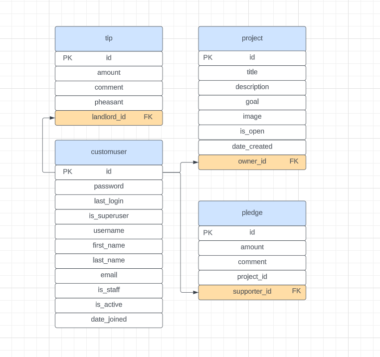
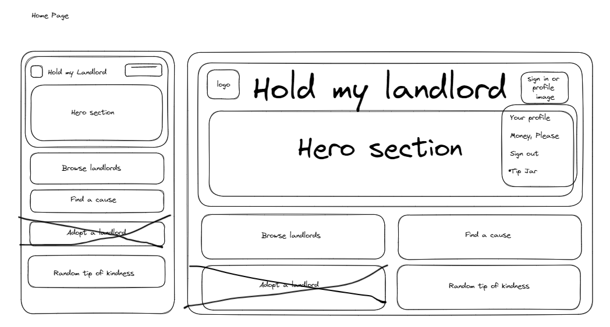
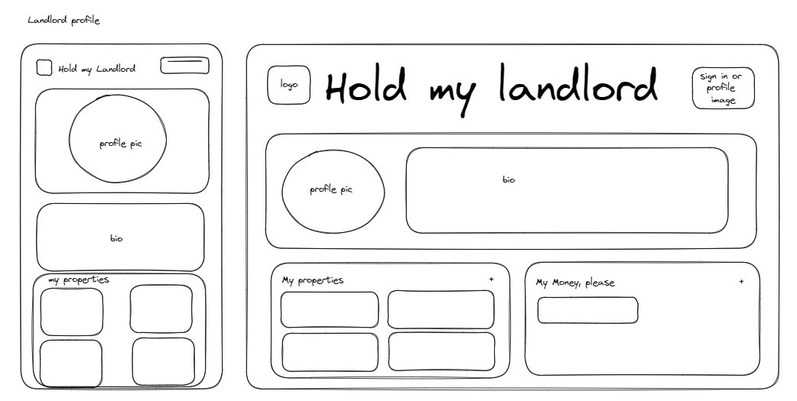
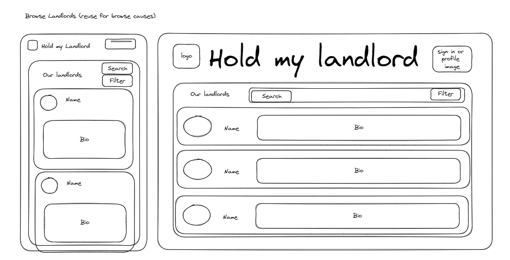
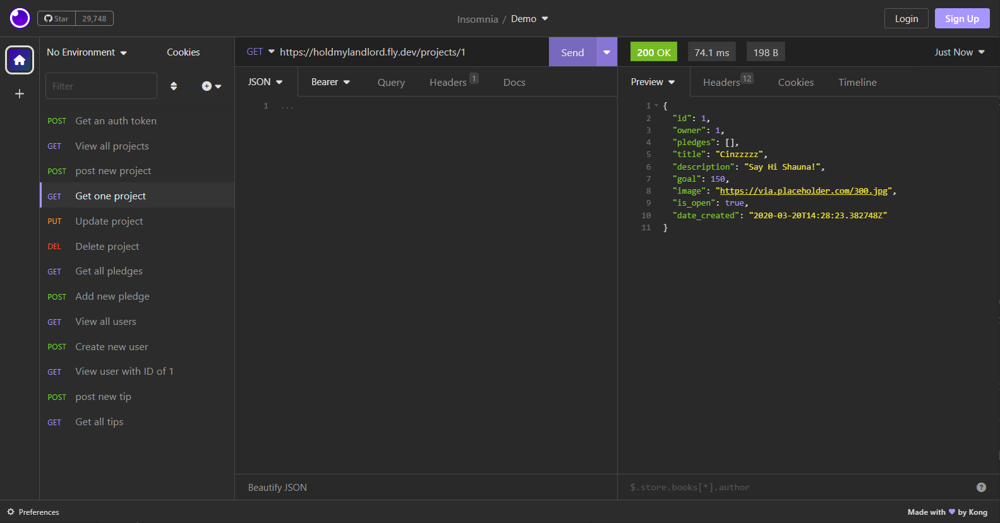
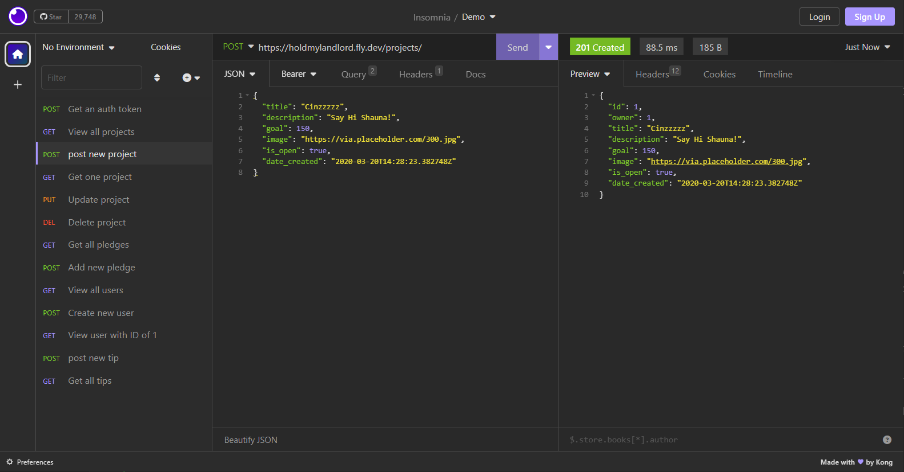
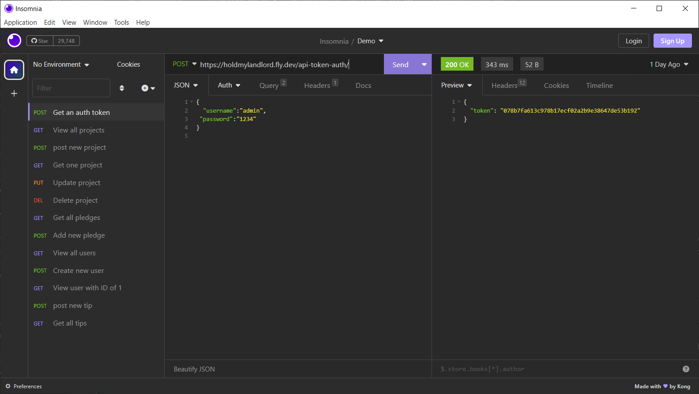

# HoldMyLandlord

# Hold my landlord by Cinzia - She Codes crowdfunding project - DRF Backend. 

## About: Hold my landlord is a crowdfund website where ungrateful tenants can support landlords across Australia to help them pay for maintenance bills, taxes, a new jet-ski, anything really! With the seemingly ever increasing interest rates, our landlords, home providers and guardian angels are the ones doing it the toughest. It’s time to give give something back. On top of your rent. That you pay regularly and on time. And is above market. Don’t forget to tip!

## Features: 
*Money, please (AKA projects): With Money Please landlords are able to post requests for money for a specific cause.
*Supporters cannot post anonymously to maximize guilt and shame pheasants into higher donations.
*Random tip of kindness: go on, you know you want to feel better about lowering their property values by living in them. Give a random tip to a random landlord using our spinning wheel of tips.

### Stretch Goals 
*Know your landlord: Landlords will have their own dedicated profiles, where you’ll find their bio with their story on how they became involved in this selfless business, info on how many properties they own, their total asset value, as well as how much rent each property returns. 

## | API Specification | HTTP Method | Url           | Purpose            | Request Body   | Successful Response Code | Authentication / Authorization |
| ----------------- | ------------| ------------- | ------------------ | -------------- | ----------------------- | ------------------------------ |
  
    
| POST              | api-token-auth/   | Get an auth token | token object | 200           |    |                                  |  
| GET              | projects/   | View all projects | project object | 200           |    |                                  |  
| POST              | projects/   | Post new project | project object | 201           | User must be logged in.   |                                  |  
| GET              | projects/id   | Get one specific project | project object | 200           |    |                                  |  
| PUT              | projects/id   | Update project | project object | 201           | User must be logged in and must be owner.   |                                  |  
| DEL              | projects/id   | Delete project | project object | 204           | User must be logged in and must be owner.   |                                  |  
| GET              | pledges/   | Get all pledges | pledge object | 201           |    |                                  |  
| POST              | pledges/   | Add new pledge | pledge object | 201           | User must be logged in.   |                                  |  
| GET              | users/   | View all users | user object | 200           |    |                                  |  
| POST              | users/   | Create new user | user object | 200           |    |                                  |  
| GET              | users/id   | Get one specific user | user object | 200           |    |                                  |  
| POST              | tips/   | Post new tip | tip object | 201           |    |                                  |  
| GET              | tips/   | Get all tips | tip object | 200           |    |                                  |

## Database Schema 
 

## Wireframes
  
  
  
  
  

## Colour Scheme #6E51AE #9D51AE #5162AE 
 

## Fonts 
Headers  Lugrasimo
Body Lisu Bosa

## Submission Documentation 
Deployed Project: [Deployed website](https://holdmylandlord.fly.dev/projects/) 

### How To Run
* Create a virtual environment:  
python -m venv venv
* Activate it:  
.venv/Scripts/activate
* Install the required libraries:  
pip install -r requirements.txt
* Run the server:  
python manage.py runserver 

### How To Register a New User 

Using your local endpoint /users/ and the below json run a POST request passing username, password and email:  
{  
	"username":"your_username",  
	"password":"your_password",  
	"email":"your_email_address"  
}  
  
  You should get a 200 response upon successful new user registration.

### Screenshots 
* [] A screenshot of Insomnia, demonstrating a successful GET method for any endpoint. 
 
* [] A screenshot of Insomnia, demonstrating a successful POST method for any endpoint. 
 
* [] A screenshot of Insomnia, demonstrating a token being returned. 

